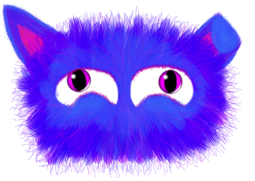

# Make your mac purr like a kitten!

A cute little furry beast will live in your touch bar, sleeping peacefully - or purring happily when you pet it. But don't go against the fur or it will slash out at you!

Great to calm your fidgets and reduce some anxiety.

## ... what?
It's an app. For Macs that have touch bars (so: MacBook Pros).
When it's running and in foreground, your furry friend will appear in your touchbar.

### To get it to purr: 
Pet it for a bit! At some point it will start looking happy and purring.

### Butbut, it's screeching!!
Don't go against the fur or too quickly! Noone likes that

## Get it (for non-developers):

1. Download this file: [PetAMac.app](PetAMac.zip)
2. Double-click in Finder (will extract a new file `PetAMac.app`)
3. Move that file to your `/Applications` folder
4. Now you can start it from Spotlight 

## Build it (For you developers out there):
Nothing special:
1. Clone the repo
2. Open the `.project` in XCode or AppCode
3. Build
4. Purr away

## But I don't have a Touch Bar :'(
Then this is probably not for you, unfortunately :/ You can use XCode to fake a TouchBar and then use your trackpad or mouse to pet - but it won't be the same.