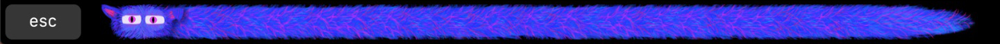
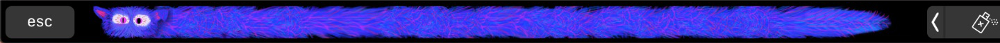

# Make your Mac purr like a kitten!

A cute little furry beast will live in your touch bar, sleeping peacefully - or purring happily when you pet it. But don't go against the fur or it will slash out at you!

Great to calm your fidgets and reduce some anxiety.

## ... what?
It's an app. For Macs that have touch bars (so: MacBook Pros).
When it's running and in foreground, your furry friend will appear in your touchbar.

#### To get it to purr: 
Pet it for a bit! At some point it will start looking happy and purring.

#### Nothing's happening:
Patience! Or: Check your volume.

#### Butbut, it's screeching!!
Don't go against the fur or too quickly! Noone likes that

## Get it (for non-developers):

1. Download this file: [PetAMac.app](PetAMac.zip). (Try right-clicking/`Save as..` in case it's not working)
2. Double-click in Finder (will extract a new file `PetAMac.app`)
3. Move that file to your `/Applications` folder
4. Now you can start it from Spotlight 

That app file is properly notarized with Apple and will *NOT* require any permissions!

## Build it (For you developers out there):
Nothing special:
1. Clone the repo
2. Open the `.project` in XCode or AppCode
3. Build
4. Purr away

## But I don't have a Touch Bar :'(
Then this is probably not for you, unfortunately :/ You can use XCode to fake a TouchBar and then use your trackpad or mouse to pet - but it won't be the same.

## That code looks like sh*t
Yes, it does. This is a fun little toy, all good software engineering practices were ignored. With a vengence.

## License?
Nah. Do whatever.

Or, as we say in Legalese:
#### MIT license

Copyright (c) 2019 Matthias Schicker

Permission is hereby granted, free of charge, to any person obtaining a copy
of this software and associated documentation files (the "Software"), to deal
in the Software without restriction, including without limitation the rights
to use, copy, modify, merge, publish, distribute, sublicense, and/or sell
copies of the Software, and to permit persons to whom the Software is
furnished to do so, subject to the following conditions:

The above copyright notice and this permission notice shall be included in all
copies or substantial portions of the Software.

THE SOFTWARE IS PROVIDED "AS IS", WITHOUT WARRANTY OF ANY KIND, EXPRESS OR
IMPLIED, INCLUDING BUT NOT LIMITED TO THE WARRANTIES OF MERCHANTABILITY,
FITNESS FOR A PARTICULAR PURPOSE AND NONINFRINGEMENT. IN NO EVENT SHALL THE
AUTHORS OR COPYRIGHT HOLDERS BE LIABLE FOR ANY CLAIM, DAMAGES OR OTHER
LIABILITY, WHETHER IN AN ACTION OF CONTRACT, TORT OR OTHERWISE, ARISING FROM,
OUT OF OR IN CONNECTION WITH THE SOFTWARE OR THE USE OR OTHER DEALINGS IN THE
SOFTWARE.